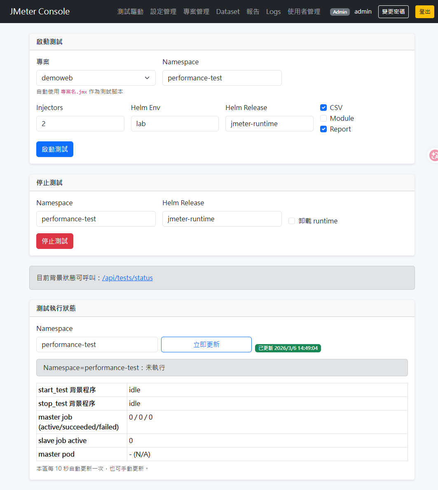

You can follow the full tutorial here : https://romain-billon.medium.com/ultimate-jmeter-kubernetes-starter-kit-7eb1a823649b

If you enjoy and want to support my work :

<a href="https://www.buymeacoffee.com/rbill" target="_blank"></a>

# JMeter k8s starterkit

This is a template repository from which you can start load testing faster when injecting load from a kubernetes cluster.

You will find inside it the necessary to organize and run your performance scenario. There is also a node monitoring tool which will monitor all your injection nodes. As well an embeded live monitoring with InfluxDB and Grafana

Thanks to [Kubernauts](https://github.com/kubernauts/jmeter-kubernetes) for the inspiration !

## 客製版重點（Helm 管理模式）

此客製版已將原本以 `kubectl create -R -f k8s/` 為主的部署方式，改為以 Helm 為主的管理模式。

- 基礎元件以 `perf-stack` release 管理（環境值檔：`k8s/helm/environments/*.yaml`）
- 測試執行期資源以 `jmeter-runtime` release 管理（由 `start_test.sh` 動態部署）
- 目的：分離「長駐基礎設施」與「每次測試工作負載」，降低資源 ownership 衝突並提升可維運性
- 目前 `metric-server`、`telegraf-operator` 仍維持非 Helm 管理（`kubectl apply -f`）

## Webapp 管理介面（FastAPI）



本專案包含一個 `webapp` 子系統（`webapp/`），提供網頁化操作能力，與本 starterkit 的關係如下：

- `start_test.sh` / `stop_test.sh` 仍是核心執行腳本；webapp 是其 UI 管理入口
- webapp 透過 Helm / kubectl 操作同一套 k8s 資源（同 namespace）
- webapp 的報表與 master 共用 PVC，才能即時瀏覽測試報告
- 參數治理採三層覆蓋用詞：環境值檔（`k8s/helm/environments/*.yaml`）→ 專案覆寫值（`scenario/<project>/deploy.values.yaml`）→ 本次執行值（`start_test.sh`）

常見流程（摘要）：

1. 打包並推送 `docker.io/isaac0815/jmeter-webapp:latest`
2. 用 `skopeo inspect` 確認遠端 `Digest`
3. 在 k8s 執行 `kubectl rollout restart deploy/jmeter-webapp`
4. 以 pod `imageID`（`@sha256:...`）比對遠端 digest

### Webapp 新增功能：資料庫還原（模擬送出）

- 新增頁面：`/db-restore`
- 可選環境來源：`config/jmeter.<env>.env`
- 需在各環境檔新增：`JMETER_FLASHBACK_DB_API=<endpoint-url>`
- 功能按鈕（目前僅預覽，不會真的發送）
  1. 建立 Flashback 任務
  2. 查詢任務狀態
  3. 查詢所有任務
  4. 取消任務

API Key / Token 請放在（已加入忽略規則）：

- `webapp/data/secrets/db_restore_tokens.json`

範例格式：

```json
{
  "lab": "your-lab-token",
  "dr-prod": "your-dr-prod-token"
}
```

完整 webapp 說明（含登入權限、image 推送、digest 驗證、k8s 啟動）請見：`webapp/README.md`

若遇到「頁面卡住 / 推版後仍舊版 / 找不到 webapp pod」等問題，可直接參考 `webapp/README.md` 的 **常見問題排查（Troubleshooting）** 章節。


## Features

<p align="center"><a href="https://ibb.co/ccM9RJp"></a></p>

| Feature     | Supported    | Comment    |
|-------------|:------------:|-------------
| Flexibility at run time      | Yes | With .env file (threads, duration, host) |
| Distributed testing      | Yes | Virtually unlimited with auto-scaling     |
| JMeter Plugin support | Yes | Modules are installed at run time by scanning the JMX needs      |
| JMeter Module support | Yes | JMeter include controller are supported if *path* is just the name of the file in the *Include Controler*
| JMeter CSV support | Yes | CSV files are splitted prior to launch the test and unique pieces copied to each pods, in the JMeter scenario, just put the name of the file in the *path* field |
| Node auto-scaling | Yes | By requesting ressources at deployment time, the cluster will scale automatically if needed |
| Reporting | Yes | The JMeter report is generated at the end of the test inside the master pod if the -r flag is used in the start_test.sh|
| Live monitoring | Yes | An InfluxDB instance and a Grafana are available in the stack |
| Report persistance | Yes | A persistence volume is used to store the reports and results |
| Injector nodes monitoring | Yes | Even if autoscaling, a Daemon Set will deploy a telegraf instance and persist the monitoring data to InfluxDB. A board is available in Grafana to show the Telegraf monitoring
| Multi thread group support | Not really | You can add multi thread groups, but if you want to use JMeter properties (like threads etc..) you need to add them in the .env and update the start_test.sh to update the "user_param" variable to add the desired variables |
| Mocking service | Yes | A deployment of Wiremock is done inside the cluster, the mappings are done inside the wiremock configmap. Also an horizontal pod autoscaler have been added
| JVM Monitoring | Yes | JMeter and Wiremock are both Java application. They have been packaged with Jolokia and Telegraf and are monitored
| Pre built Grafana Dashboards | Yes | 4 Grafana dashboards are shipped with the starter kit. Node monitoring, Kubernetes ressources monitoring, JVM monitoring and JMeter result dashboard.
| Ressource friendly | Yes | JMeter is deployed as batch job inside the cluster. Thus at the end  of the execution, pods are deleted and ressources freed


## Getting started

Prerequisites : 
- A kubernetes cluster (of course) (amd64 and arm64 architecture are supported)
- kubectl installed and a usable context to work with
- (Optionnal) A JMeter scenario (the default one attack Google.com)

### 1. Preparing the repository

You need to put your JMeter project inside the `scenario` folder, inside a folder named after the JMX (without the extension).
Put your CSV file inside the `dataset` folder, child of `scenario`
Put your JMeter modules (include controlers) inside the `module` folder, child of `scenario`

`dataset`and `module`are in `scenario` and not below inside the `<project>` folder because, in some cases, you can have multiple JMeter projects that are sharing the JMeter modules (that's the goal of using modules after all).


*Below a visual representation of the file structure*

```bash
+-- scenario
|   +-- dataset
|   +-- module
|   +-- my-scenario
|       +-- my-scenario.jmx
|       +-- .env
```

### 2. Deploying the Stack

#### From this repository

`kubectl create -R -f k8s/`

This will deploy all the needed applications :

- JMeter master and slaves
- Telegraf operator to automatically monitor the specified applications
- Telegraf as a DaemonSet on all the nodes
- InfluxDB to store the date (with a 5GB volume in a PVC)
- Grafana with a LB services and 4 included dashboard
- Wiremock

#### Using helm

> This helm project is at an very early stage, feel free to test it and open any issue for any feedbacks. Thanks you

```shell
helm repo add jmeter-k8s-starterkit-helm-charts https://rbillon59.github.io/jmeter-k8s-starterkit-helm-chart/
helm install jmeter-k8s-starterkit-helm-charts/jmeter-k8s-starterkit --generate-name
```


### 3. Starting the test

`./start_test.sh -j my-scenario.jmx -n default -c -m -i 20 -r`

Usage :
```sh
   -j <filename.jmx>
   -n <namespace>
   -c flag to split and copy csv if you use csv in your test
   -m flag to copy fragmented jmx present in scenario/project/module if you use include controller and external test fragment
   -i <injectorNumber> to scale slaves pods to the desired number of JMeter injectors
   -r flag to enable report generation at the end of the test
```


**The script will :**

- Delete and create again the JMeter jobs.
- Scale the JMeter slave deployment to the desired number of injectors
- Wait to all the slaves pods to be available. Here, available means that the filesystem is reacheable (liveness probe that cat a file inside the fs)
- If needed will split the CSV locally then copy them inside the slave pods
- If needed will upload the JMeter modules inside the slave pods
- Send the JMX file to each slave pods
- Generate and send a shell script to the slaves pods to download the necessary plugins and launch the JMeter server.
- Send the JMX to the controller 
- Generate a shell script and send it to the controller to wait for all pods to have their JMeter slave port listening (TCP 1099) and launch the performance test.


### 4. Gethering results from the master pod

After the test have been executed, the master pod job is in completed state and then, is deleted by the cleaner cronjob.

To be able to get your result, a jmeter master pod must be in ***running state*** (because the pod is mounting the persistantVolume with the reports inside).

*The master pod default behaviour is to wait until the load_test script is present in the pod*

You can run   

```sh
# If a master pod is not available, create one
helm upgrade --install jmeter-runtime k8s/helm/charts/jmeter \
  -n <namespace> --create-namespace \
  --set slaves.parallelism=0
# Wait for the pod is Running, then
kubectl cp -n <namespace> <master-pod-id>:/report/<result> ${PWD}/<local-result-name>
# To copy the content of the report from the pod to your local
```
You can do this for the generated report and the JTL for example.  


## 本專案新增功能與修改（客製版）

快速導覽：

- [1) 提供額外參數檔](#1-提供額外參數檔)
- [2) 參數前綴預處理（避免環境變數污染）](#2-參數前綴預處理避免環境變數污染)
- [3) 新增 CLI 參數](#3-新增-cli-參數)
- [4) 報表 metadata 自動注入（搭配 -r）](#4-報表-metadata-自動注入搭配--r)
- [5) jmeter-system.properties 自動帶入](#5-jmetersystemproperties-自動帶入)
- [6) CSV 分檔流程強化](#6-csv-分檔流程強化)
- [7) JMeter runtime 參數（建議改為環境分檔）](#7-jmeter-runtime-參數建議改為環境分檔)
- [8) 三層覆蓋優先序（環境值檔 / 專案覆寫值 / 本次執行值）](#8-三層覆蓋優先序環境值檔--專案覆寫值--本次執行值)

### 專案目錄結構描述

```text
jmeter-k8s-starterkit/
├── start_test.sh / stop_test.sh / reset_pvc.sh / cleanup_released_pv.sh  # 核心操作腳本
├── config/                # 環境層級參數（jmeter.<env>.env）
├── k8s/helm/              # Helm umbrella chart 與環境 values
├── scenario/              # 測試專案（JMX、.env、report-meta.env、deploy.values.yaml）
│   ├── _template/         # 專案模板
│   └── <project>/         # 實際測試專案（例如 demoweb、my-scenario）
├── report/                # 測試產出報表（HTML、statistics.json、內容資源）
├── webapp/                # FastAPI 管理介面（UI + API）
└── docs/                  # 文件與圖片資源
```

補充說明：

- `config/` 管「環境基線」，`scenario/<project>/` 管「專案與本次測試參數」。
- `k8s/helm/environments/*.yaml` 放環境值，`scenario/<project>/deploy.values.yaml` 放專案覆寫值。
- `webapp/` 透過同一套腳本與 Helm 資源操作測試流程，並讀取共用 PVC 中的報表。

### 1) 提供額外參數檔 

為了把「環境基線」與「專案參數」分離，本專案提供以下參數檔：

- `config/jmeter.<env>.env`
  - 用途：放環境層級設定（例如 lab / dr-prod 的 JVM heap 與共用參數）
  - 範例：`config/jmeter.lab.env`、`config/jmeter.dr-prod.env`
  - 讀取時機：`start_test.sh` 依 `--helm-env` 或 fallback 規則載入

- `scenario/<project>/.env`
  - 用途：放該專案測試參數（threads、duration、host、port…）
  - 作用：啟動時會轉成 JMeter `-G` 參數傳入 slave/master

- `scenario/<project>/jmeter-system.properties`
  - 用途：放 JMeter system properties（report granularity、apdex 等）
  - 作用：若存在，會自動複製到 master/slave 並以 `-S` 帶入

- `scenario/<project>/report-meta.env`
  - 用途：放報表 metadata（Environment / Versions / Notes）
  - 作用：搭配 `-r` 產報時注入到 HTML 報表

建議配置原則：

- 環境共用值放 `config/jmeter.<env>.env`
- 專案差異值放 `scenario/<project>/.env`
- 報表描述資訊放 `scenario/<project>/report-meta.env`


### 2) 參數前綴預處理（避免環境變數污染）
- 測試參數檔 `scenario/<project>/.env` 會先轉為 `JMETERTEST_*` 暫存變數，再轉成 JMeter `-G` 全域參數。
- 報表 metadata 檔（預設JMeter project目錄下 `report-meta.env`）會先轉為 `JMETERREPORT_*` 暫存變數，供報表注入使用。
- 原始 `.env` / `report-meta.env` 不會被改寫。

> 詳細說明請見：`docs/JMETER_PARAMETERS_PREFIX_PREPROCESS_GUIDE.md`

---

### 3) 新增 CLI 參數
`start_test.sh` 除了原本參數外，新增：

- `-E <env>`：測試環境（如 `prod/uat/sit/pt`）
- `-V <versions>`：版本資訊（建議以 `,` 分隔）
- `-N <note>`：備註
- `-F <file>`：指定 metadata 檔名（預設 `report-meta.env`，相對路徑會視為 `scenario/<project>/` 底下）
- `--helm-env <name>`：指定 Helm 環境值檔名稱（對應 `k8s/helm/environments/<name>.yaml`，預設 `lab`）
- `--helm-release <name>`：指定 jmeter runtime 的 Helm release 名稱（預設 `jmeter-runtime`）
- `--helm-chart <path>`：指定 jmeter runtime Helm chart 路徑（預設 `k8s/helm/charts/jmeter`）
- `--jmeter-env-file <path>`：明確指定 JMeter runtime env 檔（優先於 `config/jmeter.<helm-env>.env` / `config/jmeter.env`）

---

### 4) 報表 metadata 自動注入（搭配 `-r`）
啟用 `-r` 產報後，會將以下資訊注入 HTML 報表：
- Environment
- App Versions
- Notes

也會先做基本 HTML escape，降低特殊字元造成的版面問題。

---

### 5) `jmeter-system.properties` 自動帶入
若 `scenario/<project>/jmeter-system.properties` 存在：
- 會自動複製到 master/slave
- 執行時自動加上 `-S <path>/jmeter-system.properties`
- 並擷取部分 report 參數轉為 `-J...`（例如 granularity / apdex）

> 根目錄不再放 `jmeter-system.properties` 範例檔。請使用模板：
> `scenario/_template/jmeter-system.properties`

```bash
# 以 demoweb 專案為例
cp scenario/_template/jmeter-system.properties scenario/demoweb/jmeter-system.properties
```

---

### 6) CSV 分檔流程強化
啟用 `-c` 時：
- 先保留原始 CSV header
- 將資料列打散（shuffle）
- 依 injector 數切分後，每份再補回 header
- 分別上傳到各 slave pod

---

### 7) JMeter runtime 參數（建議改為環境分檔）
`start_test.sh` 會依序載入以下檔案（先找到先用）：

1. `--jmeter-env-file <path>`（手動指定）
2. `config/jmeter.<helm-env>.env`（例如 `config/jmeter.lab.env`、`config/jmeter.dr-prod.env`）
3. `config/jmeter.env`（fallback）

建議做法：
- `master/slave` **resources** 主要放 Helm values（`k8s/helm/environments/*.yaml` 或 `scenario/<project>/deploy.values.yaml`）
- `JMETER_MASTER_JVM_HEAP_ARGS` / `JMETER_SLAVE_JVM_HEAP_ARGS` 放在 `config/jmeter.<env>.env`

`config/jmeter.env` 可保留為共用 fallback，不再作為主要環境配置入口。

環境基線（建議）：

| 項目 | lab | dr-prod |
|---|---|---|
| JMeter Master Resources | 依 chart 預設或專案覆蓋 | requests: 1000m/2048Mi, limits: 2000m/4096Mi |
| JMeter Slave Resources | 依 chart 預設或專案覆蓋 | requests: 1000m/1024Mi, limits: 2000m/2048Mi |
| JVM Heap（Master） | `config/jmeter.lab.env` | `config/jmeter.dr-prod.env` |
| JVM Heap（Slave） | `config/jmeter.lab.env` | `config/jmeter.dr-prod.env` |

對應檔案：
- Helm resources：`k8s/helm/environments/lab.yaml`、`k8s/helm/environments/dr-prod.yaml`
- JVM heap：`config/jmeter.lab.env`、`config/jmeter.dr-prod.env`

可另外用 `scenario/<project>/deploy.values.yaml` 定義專案級部署參數，達成「環境（lab/dr-prod） + 專案 + 本次測試」三層覆蓋。

### 8) 三層覆蓋優先序（環境值檔 / 專案覆寫值 / 本次執行值）

延伸閱讀：[webapp/README.md 的同名章節](webapp/README.md#8-三層覆蓋優先序環境值檔--專案覆寫值--本次執行值)

三層覆蓋優先序（由低到高）如下：

| 層級 | 來源 | 作用 | 優先序 |
|---|---|---|---|
| 1 | `k8s/helm/environments/<env>.yaml` | 環境共用基線（lab/dr-prod） | 低 |
| 2 | `scenario/<project>/deploy.values.yaml` | 專案固定需求（例如 demoweb） | 中 |
| 3 | `start_test.sh` 本次執行產生的 run values | 本次測試動態參數（例如 `-i`） | 高 |

範例（同一個 key 衝突時誰生效）：
- `lab.yaml` 設 `slaves.parallelism: 1`
- `scenario/demoweb/deploy.values.yaml` 設 `slaves.parallelism: 4`
- 命令列帶 `-i 2`

最終會使用 `2`（因為本次執行層優先序最高）。

已提供範本：`scenario/_template/deploy.values.yaml`

```bash
# 以 demoweb 專案為例
cp scenario/_template/deploy.values.yaml scenario/demoweb/deploy.values.yaml
```

---

## 快速使用（建議）

```
# 建議部署至 performance-test namespace

# 1) 仍維持非 Helm 管理（不動）
kubectl apply -f k8s/metric-server.yaml
kubectl apply -f k8s/telegraf-operator.yaml

# 2) 建立 Helm 依賴並佈署整套資源（lab）
helm dependency build k8s/helm
helm upgrade --install perf-stack k8s/helm \
  -n performance-test --create-namespace \
  -f k8s/helm/environments/lab.yaml

# 3) 移除 Helm 管理資源
helm uninstall perf-stack -n performance-test

# 4) 移除非 Helm 管理資源
kubectl delete -f k8s/telegraf-operator.yaml
kubectl delete -f k8s/metric-server.yaml
```

```bash
./start_test.sh -j my-scenario.jmx -n default -i 2 -c -m -r \
  --helm-env lab \
  --helm-release jmeter-runtime \
  -E prod \
  -V "tip-web=1.0.1,gemfire=2.2.3" \
  -N "壓測前驗證版" \
  -F report-meta.env
```

停止測試：
```bash
./stop_test.sh -n default

# 停測後一併卸載 jmeter runtime (helm)
./stop_test.sh -n default -u --helm-release jmeter-runtime
```

> 建議：日常操作優先使用「僅 stoptest」；不要每次都 `-u`。在 `Retain` 類型 StorageClass 下，反覆刪除 PVC 會造成大量 `Released` PV 累積。
>
> 本專案 jmeter chart 預設已設定 `pvc.keepOnUninstall: true`，即使 `helm uninstall jmeter-runtime`，也會保留 `jmeter-data-dir-pvc`，以避免持續產生新 PV。

若未傳入 namespace，會自動使用 `default`，並輸出提示訊息。

```bash
./stop_test.sh
# [INFO] Namespace not provided, using default namespace: default
```

### PVC 整顆重置（含刪除 PVC 物件）

若你要直接重置 `jmeter-data-dir-pvc`（不是只清空內容），可用：

```bash
./reset_pvc.sh -n performance-test -r jmeter-runtime -p jmeter-data-dir-pvc

# 重置後自動把 report-server 拉回 1
./reset_pvc.sh -n performance-test -r jmeter-runtime -p jmeter-data-dir-pvc --restore-report-server

# 重置後自動重建 jmeter-runtime（會重建 PVC）
./reset_pvc.sh -n performance-test -r jmeter-runtime -p jmeter-data-dir-pvc --recreate-runtime --restore-report-server
```

腳本會自動執行：
- 卸載 runtime release（預設 `jmeter-runtime`）
-（可選）將 report-server scale 到 0
- 刪除 PVC
- 若卡 `Terminating`，自動 patch PVC/PV finalizers 後重試刪除

可用 `./reset_pvc.sh -h` 查看全部參數（如 `--skip-scale-report`）。

若歷史上已累積許多 `Released` PV（常見於 `Retain` StorageClass），可用以下腳本清理：

```bash
# 先 dry-run 看清單（不刪除）
./cleanup_released_pv.sh -n performance-test -c jmeter-data-dir-pvc --storage-class nfs-csi

# 確認後再實際刪除
./cleanup_released_pv.sh -n performance-test -c jmeter-data-dir-pvc --storage-class nfs-csi --execute
```

## 標準操作流程（建議）

### A) Lab 環境

```bash
# 啟動測試（Lab）
./start_test.sh -j demoweb.jmx -n performance-test -i 20 -c -m -r \
  --helm-env lab \
  --helm-release jmeter-runtime \
  -E lab \
  -V "tip-web=1.0.1,gemfire=2.2.3" \
  -N "lab smoke + baseline" \
  -F report-meta.env

# 停止測試（僅 stoptest）
./stop_test.sh -n performance-test

# 停止測試並卸載 jmeter runtime
./stop_test.sh -n performance-test -u --helm-release jmeter-runtime
```

### B) DR-Prod 環境

```bash
# 啟動測試（DR-Prod，使用私有 registry values）
./start_test.sh -j demoweb.jmx -n performance-test -i 20 -c -m -r \
  --helm-env dr-prod \
  --helm-release jmeter-runtime \
  -E dr-prod \
  -V "tip-web=1.0.1,gemfire=2.2.3" \
  -N "dr-prod full load" \
  -F report-meta.env

# 停止測試並卸載 jmeter runtime
./stop_test.sh -n performance-test -u --helm-release jmeter-runtime
```

> 參數說明可用：`./start_test.sh -h`、`./stop_test.sh -h`

## 最短指令（直接複製）

### Lab

```bash
# 佈署基礎元件
helm dependency build k8s/helm
helm upgrade --install perf-stack k8s/helm -n performance-test --create-namespace -f k8s/helm/environments/lab.yaml

# 執行測試（2 injectors）
./start_test.sh -j demoweb.jmx -n performance-test -i 2 -c -m -r --helm-env lab --helm-release jmeter-runtime

# 停測（保留 jmeter-runtime）
./stop_test.sh -n performance-test
```

### DR-Prod

```bash
# 佈署基礎元件
helm dependency build k8s/helm
helm upgrade --install perf-stack k8s/helm -n performance-test --create-namespace -f k8s/helm/environments/dr-prod.yaml

# 執行測試（2 injectors）
./start_test.sh -j demoweb.jmx -n performance-test -i 2 -c -m -r --helm-env dr-prod --helm-release jmeter-runtime

# 停測並清掉 jmeter-runtime
./stop_test.sh -n performance-test -u --helm-release jmeter-runtime
```